<div align="center">

# PersonXAI

**A personal AI operating system that lives in Telegram and WhatsApp — serverless, multilingual, free-tier-first.**

Projects · tasks · notes · wallet · file vault · long-term memory · reminders · daily brief · skills · MCP tools · web dashboard

[](https://deploy.workers.cloudflare.com/?url=https://github.com/osamam0/personxai)
&nbsp;
[](https://vercel.com/new/clone?repository-url=https%3A%2F%2Fgithub.com%2Fosamam0%2Fpersonxai&env=PERSONXAI_WORKER_URL&envDescription=Your%20PersonXAI%20Worker%20URL&envLink=https%3A%2F%2Fgithub.com%2Fosamam0%2Fpersonxai%2Fblob%2Fmain%2Fdocs%2FVERCEL.md&project-name=personxai-dashboard)
&nbsp;
[](https://supabase.com/dashboard/project/_/sql/new)
&nbsp;
[](https://t.me/BotFather)

[](.github/workflows/ci.yml)
[](docs/DOCKER.md)
[](LICENSE)
[](https://developers.cloudflare.com/agents/)
[](https://supabase.com)
[](docs/WHATSAPP.md)
[](tsconfig.json)
[](docs/FREE_TIER.md)
[](src/i18n/locales)

<br>

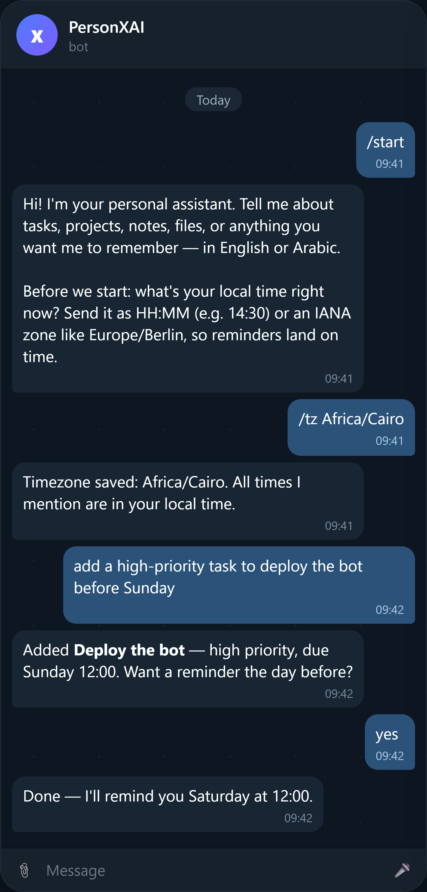&nbsp;
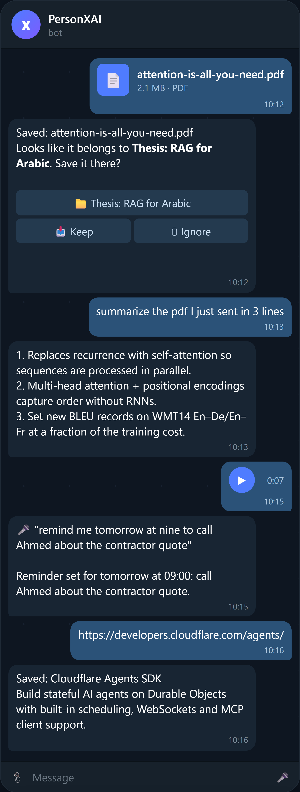&nbsp;
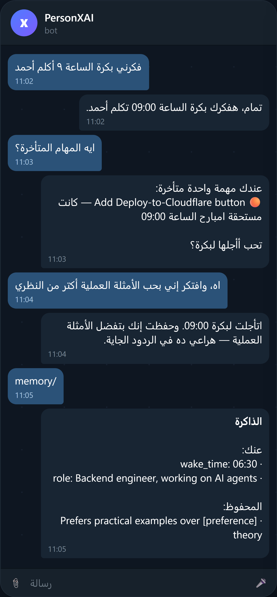

<sub>Telegram conversations (illustrative renders of real bot output) · <a href="#-screenshots">more screenshots ↓</a></sub>

</div>

---

## Why PersonXAI

Most "AI assistants" are a chat window with a model behind it. PersonXAI is the opposite: a **real database with a model in front of it**.

| | |
|---|---|
| 🧠 **The LLM is never the database** | Every project, task, note, file, memory and reminder is a Postgres row with schema, indexes and RLS. The model reads and writes only through validated, permission-gated tools — it *cannot* invent stored data. |
| ⚡ **Deterministic first** | Slash commands, button presses, bare file drops and bare links never touch the model. That is the cost backbone that keeps the whole thing inside free tiers. |
| 🗄️ **Telegram is the file vault** | Files are *forwarded* to a private channel and returned with `copyMessage`. Bytes never transit the Worker, so Telegram's 20 MB download cap does not apply to storage — **2 GB files work**. Connect **several channels** (research, receipts, photos…) with a category and tags in their description; the assistant routes each file to the right one, every file links back to its post, and the dashboard groups your library by channel. |
| 🧩 **Provider-agnostic LLM** | One variable picks a preset (`cloudflare` · `groq` · `openrouter` · `openai`) or `custom` for **any** OpenAI-compatible endpoint. Main / classifier / embeddings / STT / vision can each go somewhere different. |
| 🌍 **Multilingual by design** | English, Modern Standard Arabic and Egyptian Arabic — mixed in one message if you like. Technical terms stay in English, dates render in Latin digits, RTL just works. |
| 🕹️ **You stay in control** | Four autonomy levels, inline **Confirm / Cancel** for destructive or external actions, an audit log of every tool call, a Telegram allowlist, a rate limiter. |
| 💬 **Two channels, one brain** | Telegram and **WhatsApp** (Cloud API) plug into the same `ChannelAdapter` seam. Your WhatsApp number links to the same account: same projects, files, memory and reminders. Confirm/Cancel buttons become WhatsApp reply buttons; files sent on WhatsApp land in the Telegram vault. |
| 🖥️ **One deploy, two surfaces** | The web dashboard ships as static assets *on the same Worker* — same origin, same session, same repos. No second service, no CORS, no build step, no framework. Prefer a Vercel domain? [`vercel.json` + Edge Middleware](docs/VERCEL.md) proxy it to the Worker. |
| 🐳 **Runs where you want** | Cloudflare by default at $0. Or `docker compose up` for the identical Worker on workerd with persistent Durable Objects — [DOCKER.md](docs/DOCKER.md). |
| 💸 **$0 / month** | Designed for the free tiers of Cloudflare, Supabase and Telegram, plus a free LLM tier (or Workers AI with **zero** external accounts). Free-tier regressions are treated as bugs — see [docs/FREE_TIER.md](docs/FREE_TIER.md). |

---

## Quick start — three ways

> **Prerequisites (all free):** a Telegram account · a [Cloudflare](https://dash.cloudflare.com/sign-up) account · a [Supabase](https://database.new) project · Node 20+.

### 1 · The wizard (recommended, ~10 minutes)

```bash
git clone https://github.com/osamam0/personxai && cd personxai
npm install
npm run setup
```

`npm run setup` walks you through everything and **does the work for you**: verifies the bot token, auto-detects your Telegram id and vault-channel id, checks the Supabase schema (and tells you exactly where to paste it), generates the random secrets, logs wrangler in, deploys, uploads secrets, registers the webhook **and publishes the `/` command menu in English and Arabic**. Re-run it any time — your values are remembered as defaults.

<details>
<summary>What the wizard looks like</summary>
<br>
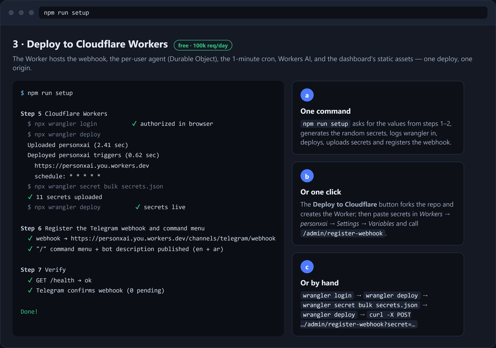
</details>

### 2 · One-click deploy

[](https://deploy.workers.cloudflare.com/?url=https://github.com/osamam0/personxai)

The button forks the repo into your GitHub and creates the Worker with CI/CD wired up. Afterwards: run [`supabase/schema.sql`](supabase/schema.sql) in your Supabase SQL editor, add the secrets in *Workers → personxai → Settings → Variables and Secrets* (list in [`secrets.example.json`](secrets.example.json)), then register the webhook:

```bash
curl -X POST "https://personxai.<you>.workers.dev/admin/register-webhook?secret=<DISPATCH_SECRET>"
```

### 3 · By hand

Follow the illustrated runbook: **[docs/DEPLOYMENT.md](docs/DEPLOYMENT.md)** — Telegram → Supabase → LLM → Cloudflare → webhook → verify, with a screenshot for every step.

Then DM your bot `/start`. The first message from `OWNER_TELEGRAM_ID` provisions the owner account.

### 4 · Docker (self-hosted)

```bash
cp .dev.vars.example .dev.vars      # Telegram + Supabase + an external LLM preset (not "cloudflare")
docker compose up -d --build        # app on :8787, a cron sidecar, optional Cloudflare Tunnel profile
```

The container runs the **same Worker on workerd** (Durable Objects and all) via wrangler; only Workers AI and the cron trigger are swapped for an external LLM and a sidecar. Details, tunnel setup and the GHCR image: **[docs/DOCKER.md](docs/DOCKER.md)**.

### + WhatsApp

Add the WhatsApp Cloud API as a second channel in ~15 minutes (Meta app → four secrets → paste the webhook URL): **[docs/WHATSAPP.md](docs/WHATSAPP.md)**. The wizard has an optional step for it.

### + Vercel

Host the dashboard on Vercel in front of the Worker with the button above or `vercel --prod`; one env var on Vercel, two on the Worker: **[docs/VERCEL.md](docs/VERCEL.md)**.

---

## What it does

<table>
<tr>
<td width="50%" valign="top">

**📥 Capture anything**
Text, voice notes, documents, photos, albums and links all land somewhere sensible. Files go to the vault and stay searchable by name, caption, extracted text, tag or *meaning*. Voice notes are transcribed. Bare URLs are fetched, summarised and bookmarked without spending a model turn.

**🗂️ Organise**
Projects, tasks (subtasks, dependencies, RRULE recurrence, priorities), notes, and an **inbox** that classifies what you dropped in and offers one-tap **Task / Note / Dismiss**. Everything is **tagged** on save — the assistant reuses your vocabulary and asks when unsure — so `/find #thesis` or a chip in the dashboard is one indexed query.

**📑 Browse by tapping**
Every list in Telegram is **paged** (◀ 1/3 ▶), **grouped** (by project, tag, status, channel …) and **selectable** — tap a number to open a detail card with Done / Snooze / Pin / Send / Move / Delete. No model calls; one query per page.

**🧠 Remember**
Long-term memory separate from chat history: typed memories with importance, plus short keyed **facts about you** shown to the assistant every turn. Retrieval is hybrid (pg_trgm keyword + pgvector HNSW) and never dumps the database into the prompt.

</td>
<td width="50%" valign="top">

**⏰ Act on time**
Natural-language reminders — one-off and recurring via RRULE, timezone-correct across DST — a **daily brief** built from real rows, and a **heartbeat** that stays silent (and free) when nothing needs you.

**🧩 Extend**
A **skill registry** for repeatable workflows the model follows step by step, a versioned **personalisation layer** for durable behaviour changes, and **MCP servers** whose tools arrive already permission-gated.

**🖥️ See it all**
A dashboard for every project, task, note, file, memory, reminder, link, skill and MCP server, plus usage, the audit trail, the live model configuration and the assistant's own instructions — all editable. Sign-in is a one-time link the bot DMs you: **no password, no third-party identity provider**.

</td>
</tr>
</table>

---

## 📸 Screenshots

<details open>
<summary><b>Telegram</b></summary>
<br>
<p align="center">
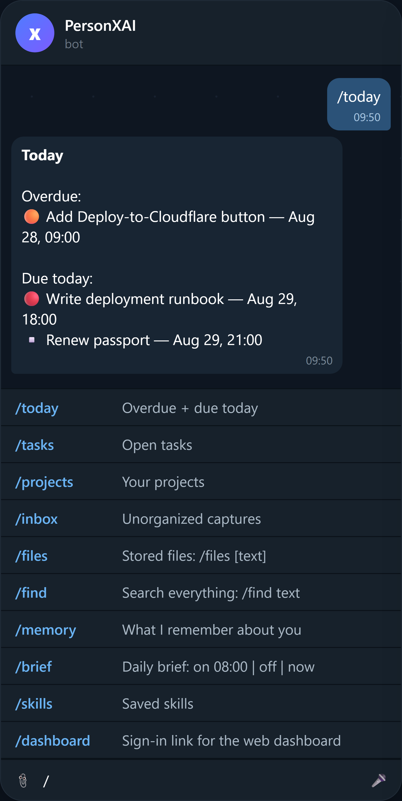&nbsp;
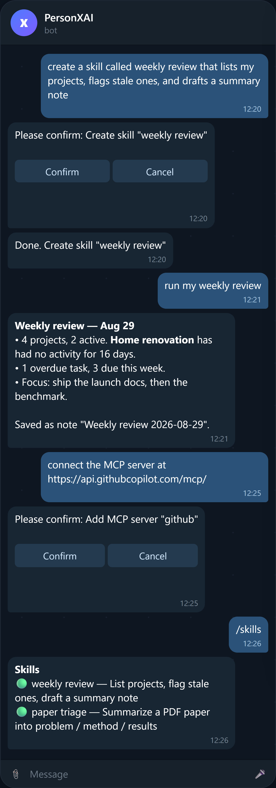&nbsp;
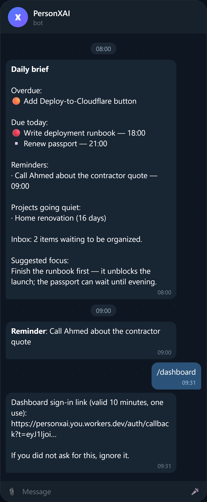
</p>
<p align="center"><sub>Command menu (auto-published, en + ar) · skills, MCP and Confirm/Cancel gates · daily brief, reminder delivery, dashboard sign-in link</sub></p>
<p align="center">
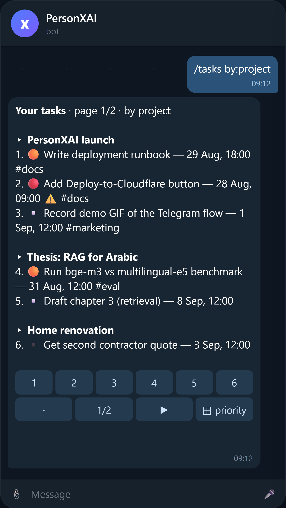&nbsp;
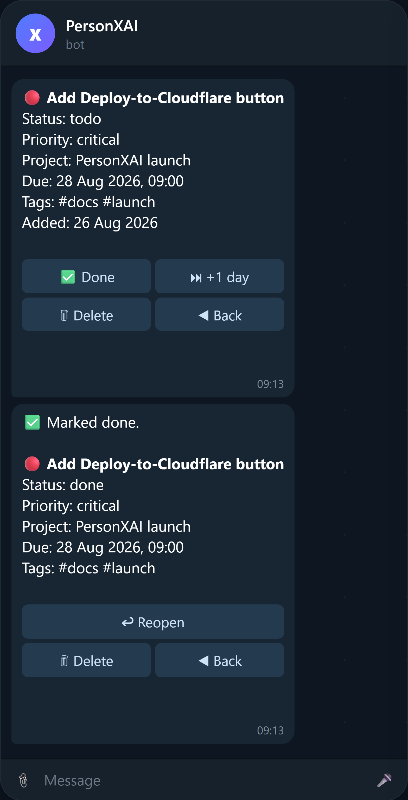&nbsp;
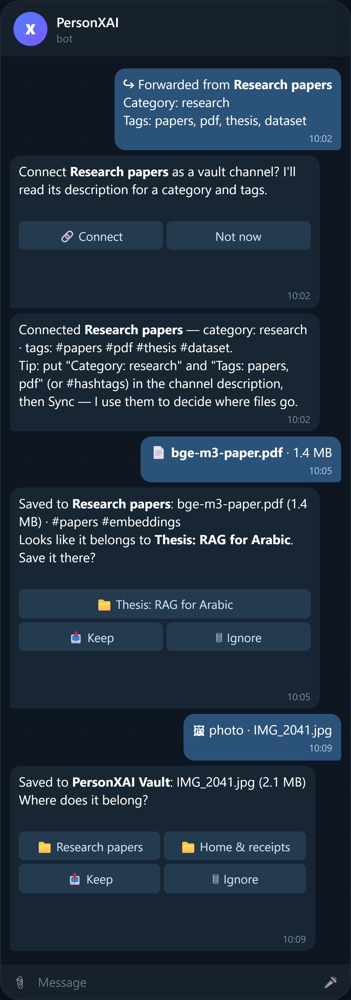
</p>
<p align="center"><sub>Paged &amp; grouped lists with tap-to-open · detail cards with actions · multiple vault channels, connected by forwarding a post</sub></p>
</details>

<details open>
<summary><b>Web dashboard</b></summary>
<br>
<p align="center"></p>
<p align="center">
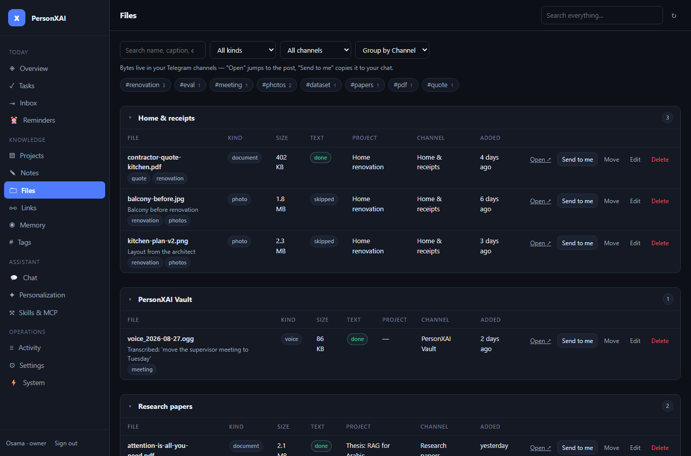
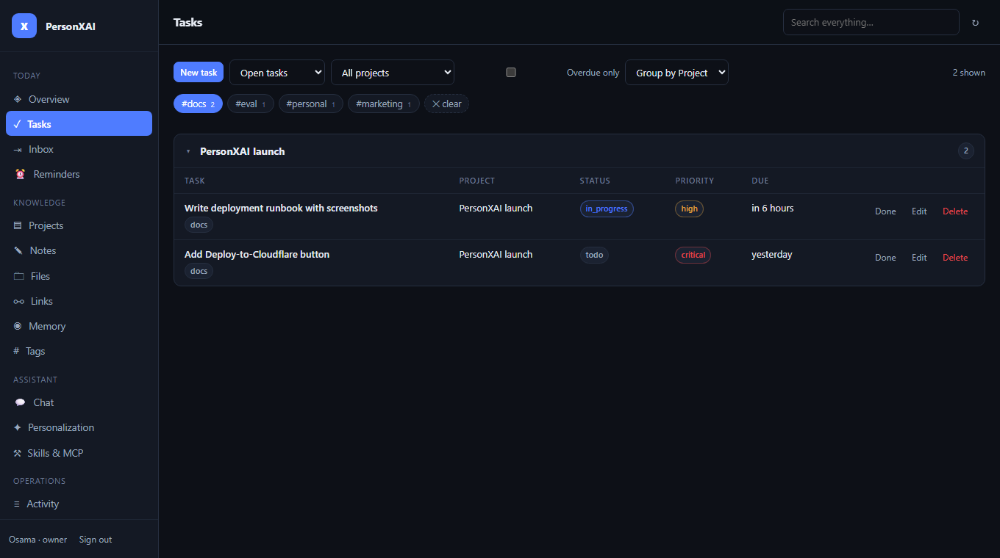
</p>
<p align="center">
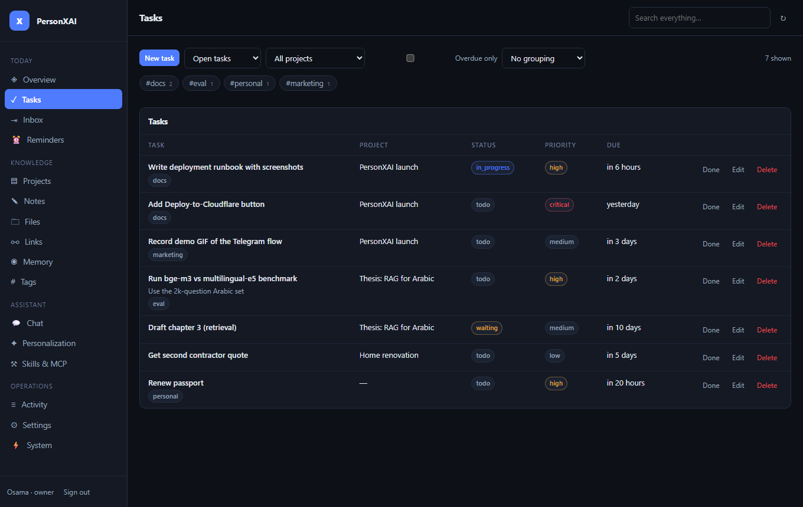
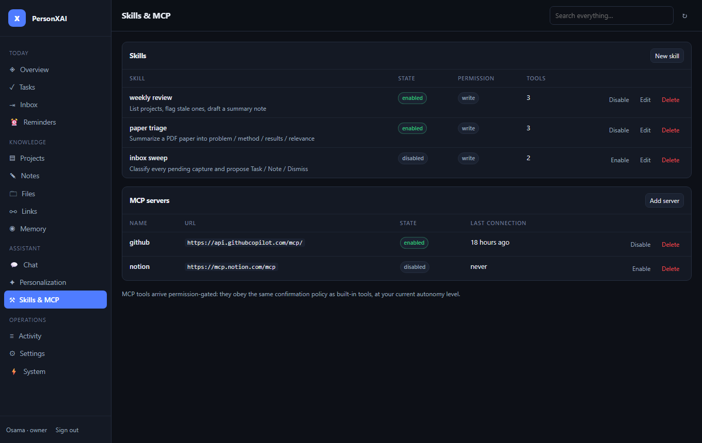
</p>
<p align="center">
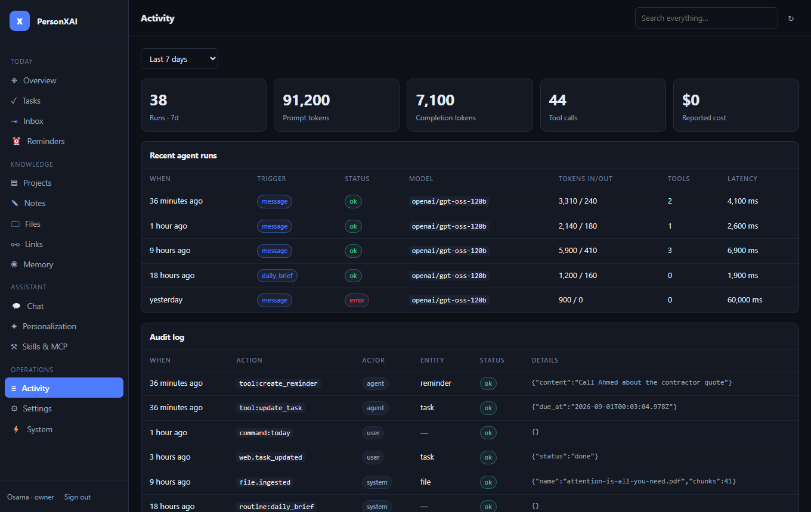
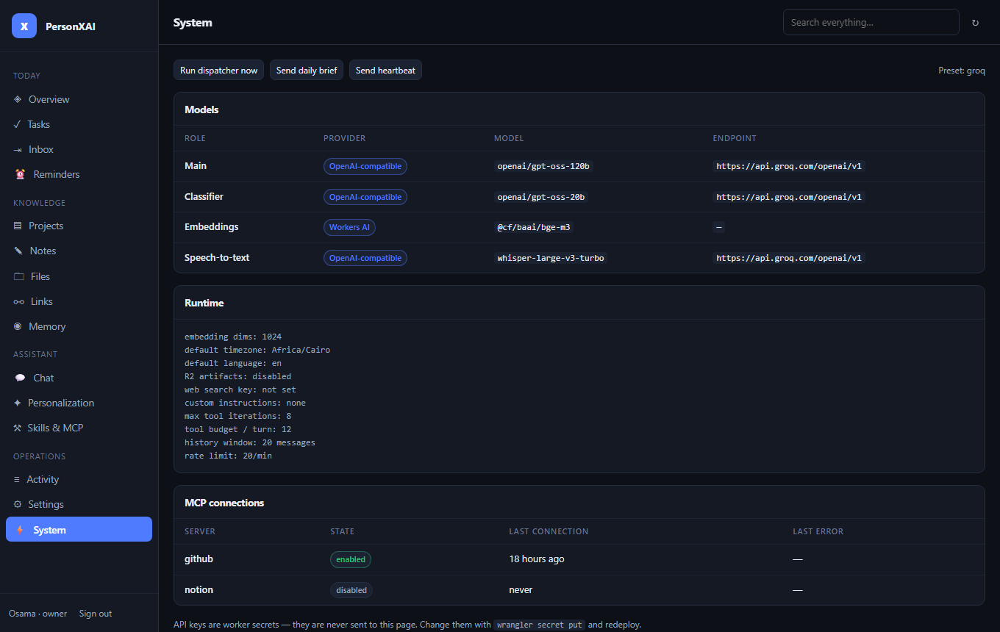
</p>
<p align="center">
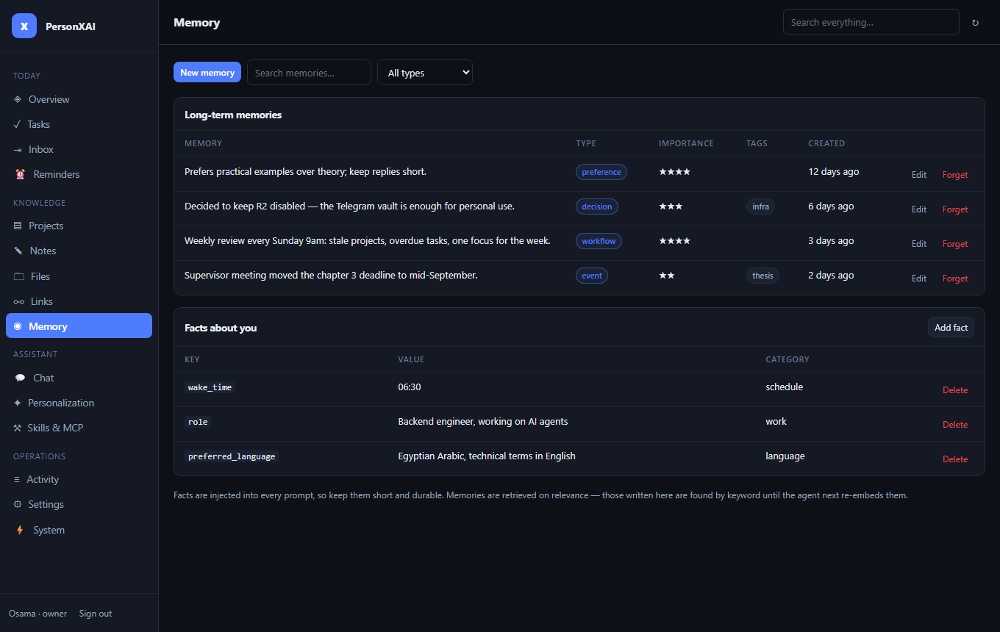

</p>
<p align="center">
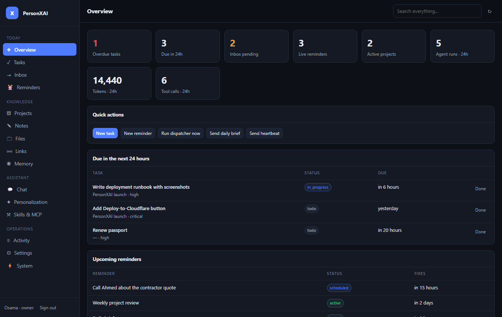
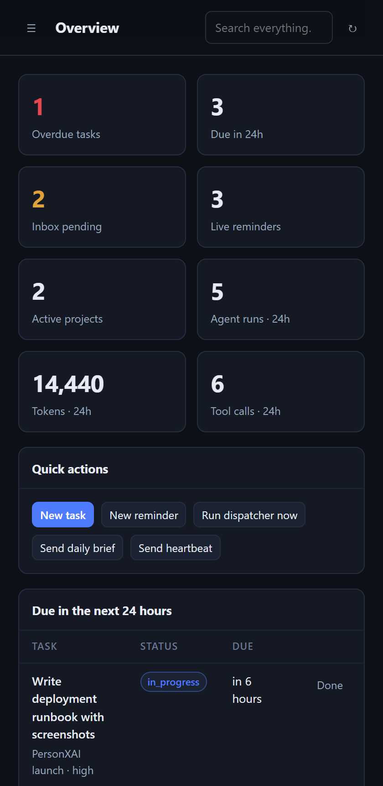
</p>
<p align="center"><sub>The dashboard follows your OS theme and is fully responsive. Screenshots show the real UI with demo data.</sub></p>
</details>

<details>
<summary><b>Login page</b></summary>
<br>
<p align="center">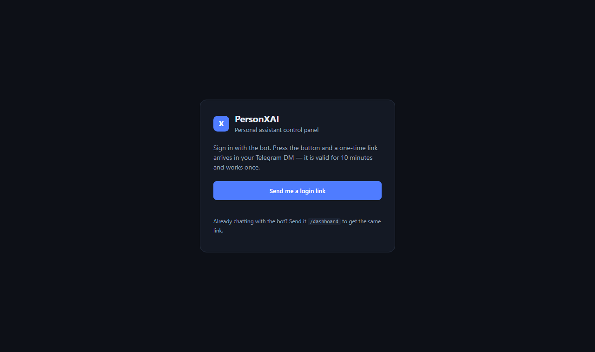</p>
</details>

---

## Architecture

<p align="center">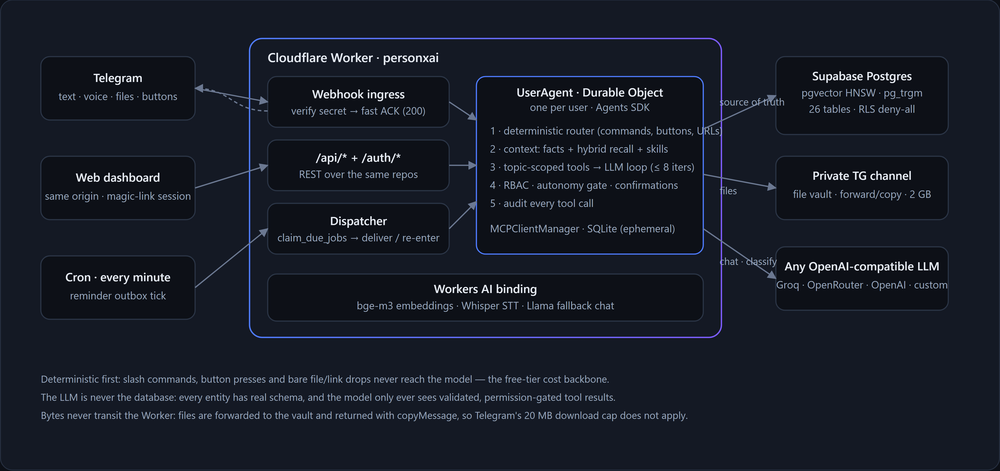</p>

```
Telegram · WhatsApp (→ Discord … later) ⇄ Cloudflare Worker ── fast-ACK webhooks (ChannelAdapter seam)
Web dashboard (same Worker, or Vercel) ⇄ ┘        │
                                                  └→ per-user Durable Object (Agents SDK)
                                                      deterministic router → context assembly
                                                      → topic-scoped tools → LLM loop → reply
Supabase Postgres + pgvector = source of truth   ·   DO SQLite = ephemeral only
Private Telegram channel    = file vault         ·   1-min cron → reminder outbox
Same Worker in Docker (workerd via wrangler)     ·   cron sidecar → POST /dispatch
```

Read the full walkthrough in **[docs/ARCHITECTURE.md](docs/ARCHITECTURE.md)** — request lifecycle, the tool registry, the permission matrix, the outbox reminder engine, hybrid retrieval, and what lives where.

---

## Technology — state of the art, nothing exotic

| Layer | Choice | Why |
|---|---|---|
| **Runtime** | [Cloudflare Workers](https://workers.cloudflare.com) + [Durable Objects](https://developers.cloudflare.com/durable-objects/) via the [**Agents SDK**](https://developers.cloudflare.com/agents/) (`agents@0.21`) | Globally distributed, zero cold-start-to-worry-about, one strongly-consistent actor per user with built-in MCP client, hibernation and SQLite. |
| **Agent loop** | [Vercel **AI SDK v7**](https://ai-sdk.dev) (`ai`, `@ai-sdk/openai-compatible`, `workers-ai-provider`) | Provider-neutral tool calling and streaming; swap models with one env var. |
| **Tool contracts** | [**Zod 4**](https://zod.dev) | Every tool input is validated *before* it executes; schemas double as the model's function signatures. |
| **Database** | [**Supabase Postgres**](https://supabase.com) + [`pgvector`](https://github.com/pgvector/pgvector) (HNSW, cosine) + `pg_trgm` + GIN-indexed `text[]` tags | Real schema, real indexes, RLS deny-all, hybrid keyword + semantic search in SQL functions, tag facets in one RPC. |
| **Embeddings** | Workers AI [`@cf/baai/bge-m3`](https://developers.cloudflare.com/workers-ai/models/bge-m3/) (1024-d, multilingual) | Arabic and English in one vector space, on the free Workers AI tier. |
| **Speech** | Workers AI `whisper-large-v3-turbo`, Groq Whisper, or OpenAI `whisper-1` | Voice notes become text before routing — same path as typed text. |
| **Documents** | [`unpdf`](https://github.com/unjs/unpdf) (pdf.js for Workers) + lazy chunking | Extracted text and chunks are embedded for "summarise the PDF I just sent". |
| **Scheduling** | Postgres **outbox** (`SKIP LOCKED` claims, leases, exponential backoff, dead-letter) + a single 1-minute Cron Trigger; [`rrule`](https://github.com/jkbrzt/rrule) + [`date-fns-tz`](https://github.com/marnusw/date-fns-tz) | Exactly-once delivery without pg_cron or daemons; DST-correct recurrence. |
| **Channels** | Telegram Bot API (webhook secret token, inline keyboards, `copyMessage` vault) and **WhatsApp Cloud API** (HMAC-signed webhooks, interactive reply buttons/lists, typing indicators) behind one `ChannelAdapter` interface | Add Discord or Slack without touching the core; WhatsApp is the worked example. |
| **Hosting** | Cloudflare Workers; **Docker** (`wrangler dev` on workerd, GHCR image, compose with cron + tunnel sidecars); **Vercel** (static dashboard + Edge Middleware proxy) | Same code everywhere; the runtime is never reimplemented. |
| **Extensibility** | [**Model Context Protocol**](https://modelcontextprotocol.io) client (via Agents SDK `MCPClientManager`) + a database-backed skill registry | Third-party tools and user-defined workflows arrive through the same permission gate. |
| **Dashboard** | Workers **Static Assets** on the same origin; vanilla ES modules, no framework, no bundler | Asset requests aren't billed as invocations; magic-link auth with HMAC-signed, domain-separated tokens. |
| **Security** | Constant-time secret comparison, RBAC (`owner / admin / user / viewer`), autonomy matrix, per-tool timeouts, result truncation, token-redacting logs, `Origin` + `Sec-Fetch-Site` CSRF guard | Every write — bot or dashboard — lands in `audit_logs`. |
| **Quality** | TypeScript 5.9 strict, [Vitest 4](https://vitest.dev) on `@cloudflare/vitest-pool-workers`, 200+ unit tests, GitHub Actions CI/CD | `npm run check && npm test` is the contract. |

---

## Commands

Type `/` in Telegram — the menu is published automatically (English and Arabic) when you register the webhook.

| Command | Does |
|---|---|
| `/today` | overdue + due today |
| `/tasks` · `/projects` · `/project name` | lists and one project's details |
| `/notes text` · `/find text` · `/files [text]` · `/links [text]` | search — notes, everything, files, saved links. Add `#tag`, `by:project`, `kind:photo`, `in:channel` to any of them |
| `/wallet [today\|week\|month\|all] [in\|out]` | the money ledger: in · out · left for the period, then every entry. `/wallet currency EGP` sets the default |
| `/tags` · `/tag name` · `/vault` | tag index (tap to browse) · everything with a tag · vault channels (connect, default, sync) |
| `/inbox` | unorganised captures |
| `/memory [text]` · `/remember text` | what the assistant remembers · keep a fact (no LLM turn) |
| `/reminders` | upcoming reminders |
| `/brief on 08:00 \| off \| now` · `/heartbeat on 4 \| off \| now` | daily brief · periodic nudges |
| `/skills` · `/mcp` | saved skills · connected MCP servers |
| `/connect` | token so Claude Code / Codex can drive the assistant over MCP (`read`, `status`, `off`) |
| `/dashboard` | one-time sign-in link for the web dashboard |
| `/status` · `/settings` · `/tz` | usage & settings · change language / autonomy · timezone |
| `/newchat` · `/contexts` · `/context name` · `/cancel` · `/help` | conversation contexts · clear pending confirmations · help |

Commands are the fast path; **plain language (English or Arabic) is the main one**. Full reference with examples: [docs/COMMANDS.md](docs/COMMANDS.md).

---

## Documentation

| | |
|---|---|
| 🚀 [**Deployment runbook**](docs/DEPLOYMENT.md) | Illustrated, step by step: Telegram, Supabase, LLM keys, Cloudflare, webhook, verify, custom domain, troubleshooting. |
| 🔑 [**Configuration reference**](docs/CONFIGURATION.md) | Every secret and variable, one by one: where to get it, what it should look like, how to verify it, how to rotate it. |
| 💬 [**Commands & conversation guide**](docs/COMMANDS.md) | Every command, every natural-language pattern, the confirmation buttons, contexts, Arabic examples. |
| 🧩 [**Skills, personalisation & MCP**](docs/SKILLS.md) | Create skills from chat or the dashboard, trigger phrases, allowed tools, connecting MCP servers, the permission matrix. |
| 🏗️ [**Architecture**](docs/ARCHITECTURE.md) | Request lifecycle, tool registry, prompt assembly, retrieval, outbox scheduler, data model. |
| 🖥️ [**Web dashboard**](docs/DASHBOARD.md) | Hosting, the magic-link auth model (and why redeem is a POST), what you can control, API shape. |
| 🔌 [**MCP server**](docs/MCP_SERVER.md) | Use the assistant from Claude Code or Codex: tokens and scopes, `ask_assistant`, the permission model, endpoint reference. |
| 💚 [**WhatsApp**](docs/WHATSAPP.md) | Cloud API setup, what degrades and how, the 24-hour window, troubleshooting. |
| 🐳 [**Docker**](docs/DOCKER.md) | Self-hosting the identical Worker on workerd; compose stack, tunnel, LLM without Workers AI. |
| ▲ [**Vercel**](docs/VERCEL.md) | Dashboard on a Vercel domain in front of the Worker; `PUBLIC_BASE_URL` + `ALLOWED_ORIGINS`. |
| 💸 [**Free-tier fit**](docs/FREE_TIER.md) | Budgets vs. caps, the six LLM recipes, mixing providers per role, enabling R2. |
| 🔌 [**Extending**](docs/EXTENDING.md) | New channels, new tools, MCP servers, scheduled behaviours. |
| 🔁 [**Re-embedding**](docs/RE_EMBEDDING.md) | Switching embedding models/dimensions safely. |
| ✅ [**Manual E2E checklist**](docs/MANUAL_E2E.md) | What only a real Telegram round trip can prove. |
| 🤝 [**Contributing**](CONTRIBUTING.md) | Dev loop, tests, free-tier rules, how to add a migration. |

---

## Local development

```bash
cp .dev.vars.example .dev.vars      # or let `npm run setup` write it
npm run dev                          # wrangler dev → http://localhost:8787 (bot API + dashboard)
npm test                             # vitest, 200+ tests, ~3 s
npm run check                        # tsc --noEmit
npm run db:reset -- wallet           # wipe one module (or `all`, `all --drop`) — docs/DEPLOYMENT.md
npx wrangler tail                    # live logs from production
npm run docker:up                    # docker compose up -d --build (docs/DOCKER.md)
```

> `wrangler dev` needs a Cloudflare login for the Workers AI binding. `wrangler.dev.jsonc` (git-ignored, see [DEPLOYMENT.md](docs/DEPLOYMENT.md#local-development)) drops that binding so the stack runs fully offline with an external LLM preset — embedding failures are non-fatal by design.

---

## Project status & roadmap

Phases 1–7 are shipped: foundation, productivity, files, memory & search, automation, skills & MCP, the web dashboard, and now **multi-channel (WhatsApp) + multi-host (Docker, Vercel)**.

Next up (help welcome): WhatsApp message templates for out-of-window reminders · Discord/Slack adapters · Cloudflare Browser Rendering as a research tool · OCR for photos · image generation into the vault · Google Calendar / Gmail via MCP. See [docs/EXTENDING.md](docs/EXTENDING.md).

## Credits & inspiration

Architecture and code patterns ported (with attribution in-file) from:
- [openmemo](https://github.com/haerincode/openmemo) — outbox reminder engine, timezone write-guard, Telegram hardening
- [TeleFileBot-CloudFlare](https://github.com/kmahmed3844/TeleFileBot-CloudFlare) — Telegram-channel file vault pattern
- [natural-db](https://github.com/supabase-community/natural-db) — routine re-entry, layered system prompts
- [Stacks](https://getstacksapp.com) — tool registry + topic-based prompt selection (used with the author's knowledge)
- [Cloudflare Agents SDK](https://github.com/cloudflare/agents) — serverless agent runtime

## License

[MIT](LICENSE) — use it, fork it, ship it.
