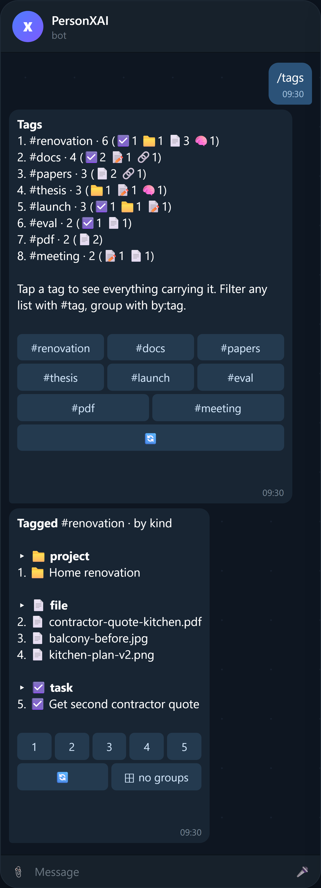
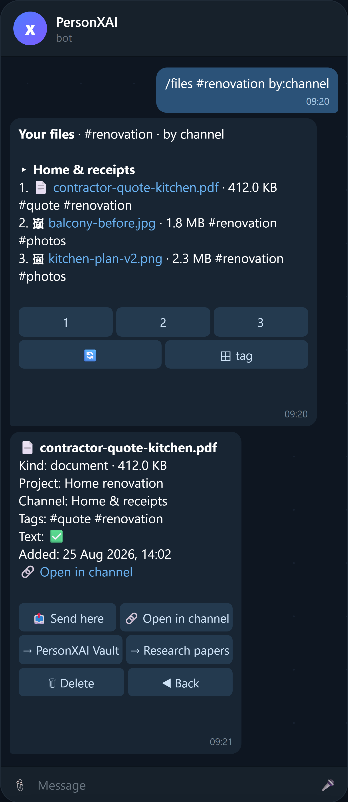

# Commands & conversation guide

PersonXAI has two input paths, and they are deliberately different:

| Path | Cost | Latency | Use it for |
|---|---|---|---|
| **Slash commands** (`/today`, `/files …`) | zero model calls | ~200 ms | listing, searching, settings — anything with an exact answer |
| **Plain language** (English, Arabic, Egyptian Arabic, mixed) | one agent run | 2–6 s | anything that needs judgement: creating, updating, summarising, planning |

Button presses, bare file drops and bare URLs also never reach the model. That is what keeps the whole system in free tiers ([FREE_TIER.md](FREE_TIER.md)).

<p> </p>

## Slash commands

The menu appears when you type `/` — it is published by `POST /admin/register-webhook` in English and Arabic, and a unit test guarantees every menu entry has a handler.

### Every list is a page you can tap

<p> </p>

`/tasks`, `/today`, `/projects`, `/notes`, `/files`, `/links`, `/memory`, `/reminders`, `/inbox`, `/wallet`, `/tags` and `/find` all reply with the same kind of message:

- **Numbered lines, six per page**, with ◀ `1/3` ▶ buttons to page and a `🔄` to refresh. Pages re-render in place — no message spam.
- **A number button per line** opens that item's **detail card**: every field, plus actions that fit the kind — `✅ Done` · `⏭ +1 day` · `📌 Pin` · `📤 Send here` · `→ Move to channel` · `⏸ Pause` · `🗑 Delete` (two taps: the second confirms) · `◀ Back` to the page you came from.
- **`⊞ group` cycles the grouping** — by project, status, priority, tag, kind, channel, date, or none — and the page shows `▸ Group` headers.
- **Filters in the command**: `#tag` (repeatable, all must match), `by:project|tag|status|priority|kind|channel|category|date`, `kind:photo`, `status:done`, `cat:groceries` and `dir:out` (wallet), `in:research` (a vault channel), and free text.

```
/tasks #docs by:priority         open tasks tagged docs, grouped by priority
/files thesis kind:document      documents whose name/caption/text mention "thesis"
/files #renovation by:channel    renovation files grouped by the channel they live in
/notes #meeting                  notes tagged meeting
/find #pdf                       everything (any kind) tagged pdf, grouped by kind
/memory type:decision            decisions only
/wallet week out                   last 7 days of spending
/wallet all cat:rent               every rent payment, any date
```

None of this touches the model: a page is one indexed query.

### Today & tasks

| Command | Output |
|---|---|
| `/today` | Overdue tasks, then tasks due today, with priority icons 🔴 critical 🟠 high ▫️ medium ▪️ low. Empty state says so — and costs nothing. |
| `/tasks` | Open tasks, six per page, with due dates in your timezone; `by:` and `#tag` filters as above. |
| `/reminders` | Upcoming one-off and recurring reminders with their next fire time. |
| `/inbox` | Pending captures (things you sent that weren't clearly a task or a note). Tap one → **✅ Task / 📝 Note / 🗑 Dismiss**. |

### Projects, notes, files, links

| Command | Output |
|---|---|
| `/projects` | All projects with status icon (💡 idea 🗓 planned 🟢 active ⏸ waiting ⛔ blocked ✅ completed 📦 archived) and progress %. |
| `/project <name>` | One project: description, status, priority, due date, open/done task counts, note count, tags. Fuzzy name match. |
| `/notes [text]` | Search notes (title + content); pinned ones first. |
| `/files [text]` | Recent files, or search by name / caption / extracted text. Each line links to the post in its vault channel; `by:channel`, `in:research`, `kind:photo`, `#tag`. |
| `/links [text]` | Saved links with titles. |
| `/find <text>` (alias `/search`) | One shot across projects, tasks, notes, files, links and memories, grouped by kind; `/find #tag` for tag lookups. |

### Wallet — money in and out

| Command | Output |
|---|---|
| `/wallet` | This month's ledger: **in · out · left** in the header, then one line per entry (🔻 expense, 🔺 income) with amount, what it was for, category and date. Tap a line for its card. |
| `/wallet week out #food` | Bare words are understood: a period (`today`, `yesterday`, `week`, `month`, `year`, `all` — Arabic too: `النهاردة`, `شهر`) and a direction (`in`, `out`). |
| `/wallet cat:groceries` | One category. `dir:in`, `#tag`, `by:category` and free text work like every other list. |
| `/wallet currency EGP` | Sets the currency new entries default to. Existing entries keep the currency they were logged in. |

Totals are computed in Postgres (`wallet_summary`), per currency, over a half-open window on **your** calendar — so two consecutive months never double-count the boundary. Deleting an entry is a soft delete: it leaves the history and every total at once, and stays recoverable by an admin.

### Memory

| Command | Output |
|---|---|
| `/memory [text]` | Facts about you (key: value, injected into every prompt), then the paginated memory list. Optional search text, `#tag`, `type:preference`. |
| `/remember <text>` | Store a fact immediately — deterministic, embedded in the background, no model turn. |

### Tags

<p></p>

| Command | Output |
|---|---|
| `/tags` | Every tag with per-kind counts (☑️ tasks 📁 projects 📝 notes 📄 files 🔗 links 🧠 memories). Each tag is a button → everything carrying it. |
| `/tag <name>` · `/find #name` | Everything with that tag across all kinds, grouped by kind. |

Tags are the fast path for search: every table carries `tags text[]` behind a GIN index, so a tag lookup is one indexed query per kind, no embeddings, no model. The assistant **tags everything it saves** (1–3 short lowercase tags, reusing the ones you already have — they are shown to it every turn), and when the right tags or place are genuinely unclear it **asks one short question** instead of guessing. You can always say *"tag this with research, pdf"* or edit tags in the dashboard.

### Vault channels

<p> </p>

Files live in private Telegram channels. You can connect **several**, each with a category and tags, and the assistant routes new files to the right one:

| Command | Effect |
|---|---|
| `/vault` | List channels (⭐ default). Tap one for details: `🔗 Open channel` · `🔄 Sync` (re-read the description) · `⭐ Make default` · `🗑 Remove`. |
| `/vault add -1001234567890 [category] [#tags]` | Connect a channel by id (the bot must be an admin). |
| `/vault sync` | Re-read every channel description. |
| **Forward any post from a channel to the bot** | The easiest way: the bot offers **🔗 Connect**, reads the description, done. Forwarding a post from an already-connected channel opens that file's card. |

Put lines like these in the channel description (Telegram → channel → Edit → Description) and the assistant uses them as routing hints:

```
Category: research
Tags: papers, pdf, thesis, dataset
```

(`#hashtags` anywhere in the description work too; Arabic labels `تصنيف:` / `وسوم:` are understood.)

When a file arrives, one cheap classifier call decides project + channel + tags **before** the forward, so most files land in the right channel immediately. Every file message and every file card carries a **🔗 Open in channel** deep link (`t.me/c/…`), and `/files … by:channel` groups your library by where it lives. Moving a file (`→ Research papers`, or *"move that PDF to the research channel"*) copies the post into the other channel and removes the old one — bytes never transit the Worker.

### Automation

| Command | Effect |
|---|---|
| `/brief on [HH:MM]` | Daily brief at that local time (default 08:00). Overdue, due today, waiting-on, reminders, quiet projects, inbox count, then a *focus suggestion drawn only from those rows*. |
| `/brief now` | Send it immediately. |
| `/brief off` | Cancel. |
| `/heartbeat on [hours]` | Every N hours (1–12, default 4) between 08:00 and 22:00 local: a nudge **only if something is overdue**. All-clear → silent, zero LLM calls. |
| `/heartbeat now` / `/heartbeat off` | Run once / cancel. |

### Skills & MCP

| Command | Output |
|---|---|
| `/skills` | Saved skills, 🟢 enabled / ⚪ disabled, with descriptions. See [SKILLS.md](SKILLS.md). |
| `/mcp` | Connected MCP servers, 🟢 healthy / 🔴 last error / ⚪ disabled. |
| `/connect` | Issue the token that lets Claude Code, Codex or any MCP client drive this assistant. `/connect read` for a read-only token, `/connect status`, `/connect off` to revoke. See [MCP_SERVER.md](MCP_SERVER.md). |

### Account & settings

| Command | Effect |
|---|---|
| `/dashboard` | DM yourself a one-time sign-in link for the web dashboard (10 min, single use, rate-limited). |
| `/status` | Runs and tokens in the last 24 h, active context, autonomy, timezone, language, main model. |
| `/settings` | Show settings. `/settings language ar` · `/settings autonomy 2` · `/settings timezone Europe/Berlin`. |
| `/tz <zone \| HH:MM>` | Set timezone by IANA name, or send your current local time and let the bot guess. |
| `/newchat [title]` | Start a fresh conversation context (history window resets; memory persists). |
| `/contexts` / `/context <name>` | List contexts / switch to one by name. |
| `/cancel` | Clear pending Confirm/Cancel prompts. |
| `/help` | The command list. |

## Plain language — what to say

You rarely need commands. Some patterns that map to tools:

| Say | The assistant does |
|---|---|
| *"add a high-priority task to deploy the bot before Sunday"* | `create_task` with priority and due date computed in your timezone |
| *"start a project called ResumeForge"* | `create_project` |
| *"what should I focus on today?"* | reads real tasks/reminders, answers from rows — never invents |
| *"remind me tomorrow at 9 to call Ahmed"* | `create_reminder`, confirms the local time |
| *"every Sunday at 9am remind me to review my projects"* | recurring reminder (RRULE), DST-safe |
| *"remember that I prefer practical examples over theory"* | `remember` (long-term memory) |
| *"remember that my wake time is 06:30"* | `remember_about_user` (a keyed fact shown every turn) |
| *"what do you remember about how I like to learn?"* | hybrid recall across memories |
| *"summarise the PDF I just sent"* / reply to a file with *"what does this say about X?"* | `get_file_text` on the referenced file |
| *"find the PDF about transformers"* / *"send me the contractor quote"* | `find_files` → `send_file` from the vault |
| *"forget what I said about X"* | `forget_memory` — asks for confirmation first |
| *"tag this with research, pdf"* / *"what's tagged #thesis?"* | `set_tags` / `find_by_tag` (indexed, no embeddings) |
| *"I bought 2 kg of sugar for 25 LE"* / *"صرفت ٢٥ جنيه على السكر"* | `record_expense` — 25, quantity 2, unit kg, category groceries, and it says where the month stands |
| *"my salary came in, 12000"* | `record_income` |
| *"how much did I spend this month?"* / *"where does my money go?"* | `wallet_balance` — totals per currency plus the biggest categories |
| *"show me what I spent on food last week"* | `list_wallet_entries` |
| *"that sugar entry was 35 not 25"* | `update_wallet_entry` |
| *"move that PDF to the research channel"* / *"which channels do I have?"* | `move_file_to_channel` / `list_vault_channels` |
| *"create a skill called weekly review that …"* | `create_skill` — see [SKILLS.md](SKILLS.md) |
| *"connect the MCP server at https://…"* | `add_mcp_server` (external → confirmation) |
| *"from now on answer in Egyptian Arabic and keep plans to three steps"* | `set_personalization` — a new version of your instructions |

### Files, voice, links

<p></p>

- **Send a document / photo / album** → stored in the vault, text extracted (PDF, text, images via vision when configured), chunked and embedded. If it matches a project you get **📁 Project / 📥 Keep / 🗑 Ignore** buttons. Duplicates are recognised.
- **Send a voice note** → transcribed (Whisper) and handled exactly like typed text.
- **Send a bare URL** → fetched, summarised and bookmarked **without a model turn** for the capture itself.

### Arabic

<p></p>

The assistant replies in the language you are writing *right now* — English, Modern Standard Arabic, Egyptian Arabic, or a mix — keeps technical terms in English, and renders dates and times with Latin digits. `/settings language ar` changes the language of command output and the `/` menu; conversation language follows you automatically.

## Confirmations & autonomy

<p></p>

Some actions produce an inline **Confirm / Cancel** prompt instead of executing. Which ones depends on your autonomy level (`/settings autonomy N`):

| Level | write (create/update) | destructive (delete, archive) | external (MCP, web) |
|---|---|---|---|
| **0** — ask everything | confirm | confirm | confirm |
| **1** — default | run | confirm | confirm |
| **2** — trusted | run | confirm | run |
| **3** — autonomous | run | run (still confirms irreversible ones) | run |

Prompts expire after 10 minutes; a stale button says so and does nothing. `/cancel` clears all pending prompts. Every executed action — confirmed or automatic — is written to `audit_logs`, visible in the dashboard's **Activity** view.

## Contexts

A *context* is a conversation thread with its own history window. Long-term memory, facts, files and tasks are shared across all of them. Use `/newchat Thesis` to keep a research thread separate from daily planning, `/contexts` to list, `/context Thesis` to switch. The dashboard's **Chat** view shows any context's transcript and lets you send messages into it.

## Rate limits & access

- Only `OWNER_TELEGRAM_ID` is provisioned automatically; other users must be allowed (`users.is_allowed`) by the owner (dashboard → Settings, or SQL). Strangers get **one** polite refusal, then silence.
- 20 messages per minute per user; over that, a single notice per minute.
- Duplicate webhook deliveries are de-duplicated by update id.
