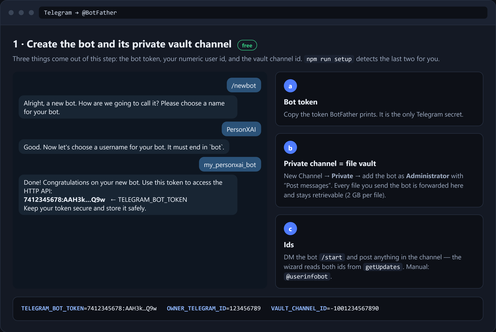
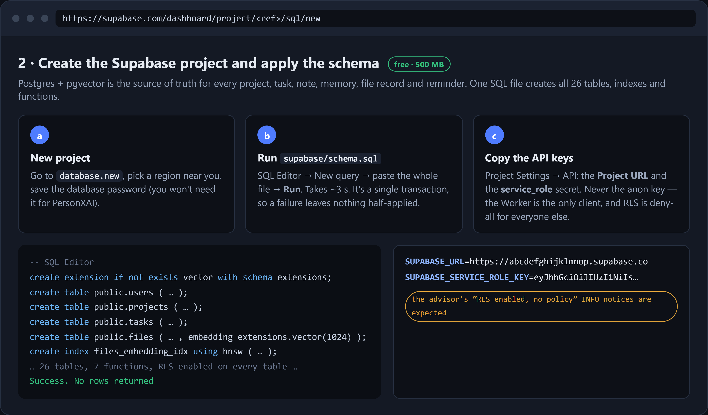

# Configuration reference — every value, step by step

This page is the companion to the [deployment runbook](DEPLOYMENT.md). The runbook says *what order* to do things in; this page says, **for each individual secret: where it comes from, exactly how to obtain it, what it looks like, and what breaks if it's wrong**.

If you'd rather not do any of this by hand, `npm run setup` collects or generates every value below and uploads them for you — see [the wizard](DEPLOYMENT.md#a-the-wizard). Read this page anyway when a value needs rotating, or when the wizard can't run (CI, one-click deploy, no terminal).

---

## The short version

| Value | Required | Where it comes from | Time |
|---|---|---|---|
| [`TELEGRAM_BOT_TOKEN`](#1--telegram_bot_token) | ✅ | [@BotFather](https://t.me/BotFather) → `/newbot` | 1 min |
| [`OWNER_TELEGRAM_ID`](#2--owner_telegram_id) | ✅ | [@userinfobot](https://t.me/userinfobot) | 30 s |
| [`VAULT_CHANNEL_ID`](#3--vault_channel_id) | ✅ | a private Telegram channel you create | 2 min |
| [`TELEGRAM_WEBHOOK_SECRET`](#4--telegram_webhook_secret) | ✅ | you generate it (random 32 bytes) | 5 s |
| [`DISPATCH_SECRET`](#5--dispatch_secret) | ✅ | you generate it (random 32 bytes) | 5 s |
| [`WEB_SESSION_SECRET`](#6--web_session_secret) | ⬜ recommended | you generate it (random 32 bytes) | 5 s |
| [`SUPABASE_URL`](#7--supabase_url) | ✅ | Supabase → Project Settings → API | 30 s |
| [`SUPABASE_SERVICE_ROLE_KEY`](#8--supabase_service_role_key) | ✅ | Supabase → Project Settings → API keys | 30 s |
| [`LLM_PRESET`](#9--llm_preset--the-model-provider) | ⬜ (defaults to Workers AI) | you choose: `cloudflare` · `groq` · `openrouter` · `openai` · `custom` | — |
| [`GROQ_API_KEY`](#groq--recommended-free) / [`OPENROUTER_API_KEY`](#openrouter--free) / [`OPENAI_API_KEY`](#openai--paid) / [`LLM_API_KEY` + `LLM_BASE_URL` + `LLM_MAIN_MODEL`](#custom--any-openai-compatible-endpoint) | depends on the preset | your provider's console | 2 min |
| [`WHATSAPP_*` + `OWNER_WHATSAPP_ID`](#11--whatsapp-optional) | ⬜ optional channel | Meta developer dashboard | 15 min |
| [Optional overrides](#10--optional-values) (`PUBLIC_BASE_URL`, `ALLOWED_ORIGINS`, `STT_*`, `VISION_*`, `EMBEDDINGS_*`, `R2_ENABLED`, …) | ⬜ | — | — |

Everything marked ✅ is validated at boot ([`src/config.ts`](../src/config.ts)). A missing or malformed one makes the Worker log `Missing/invalid required secrets: …` and refuse every request.

---

## Where these values live

There are three places, and you will normally use two of them:

| Place | What for | Committed? |
|---|---|---|
| `secrets.json` in the repo root | your local copy, uploaded to Cloudflare with one command | **No** — git-ignored |
| Cloudflare Worker secrets | what production actually reads | n/a (stored by Cloudflare, encrypted) |
| `.dev.vars` | `npm run dev` on localhost | **No** — git-ignored |

Start from the template:

```bash
cp secrets.example.json secrets.json
```

Fill it in as you work through the sections below, then push it to Cloudflare:

```bash
npx wrangler secret bulk secrets.json
npx wrangler deploy      # redeploy so the new values are live
```

> **Secrets are per-Worker, not per-deploy.** They survive `wrangler deploy`, so you only re-upload when a value changes. `secrets.json` is git-ignored — keep it that way, and never paste real values into an issue, a chat, or a screenshot. If a value has ever been exposed, rotate it (each section below says how).

Non-secret settings (`DEFAULT_TIMEZONE`, `DEFAULT_LANGUAGE`, `EMBEDDINGS_DIMS`) are plain vars in [`wrangler.jsonc`](../wrangler.jsonc), not secrets — edit them there and redeploy.

### Generating a random secret

Three of the values are random strings you invent. 32 random bytes as hex is the expected shape (the code requires ≥16 characters). Pick whichever line matches your shell:

```bash
# macOS / Linux / Git Bash
openssl rand -hex 32
```

```powershell
# Windows PowerShell — cryptographically secure, no openssl needed
$b = New-Object byte[] 32; [Security.Cryptography.RandomNumberGenerator]::Create().GetBytes($b); -join ($b | ForEach-Object { $_.ToString('x2') })
```

```bash
# Anywhere Node 20+ is installed
node -e "console.log(require('crypto').randomBytes(32).toString('hex'))"
```

Generate each one **separately** — never reuse the same string for two variables.

---

## 1 · `TELEGRAM_BOT_TOKEN`



The credential for your bot. Everything the assistant sends or receives goes through it.

1. Open [@BotFather](https://t.me/BotFather) in Telegram and press **Start**.
2. Send `/newbot`.
3. Give a **display name** — anything, e.g. `My Assistant`.
4. Give a **username** — must be unique across Telegram and must end in `bot`, e.g. `my_personx_bot`.
5. BotFather replies with `Use this token to access the HTTP API:` followed by the token. Copy it.

**Shape:** digits, a colon, then ~35 characters of letters, digits, `-` and `_` — `6113696744:AAH8…`. The part before the colon is the bot's numeric id.

**Verify it:**

```bash
curl "https://api.telegram.org/bot<TOKEN>/getMe"
# → {"ok":true,"result":{"id":…,"is_bot":true,"username":"your_bot"}}
```

**Optional, while you're in BotFather:** `/setuserpic` for an avatar; `/setprivacy` → *Disable* only if you plan to add the bot to groups (not needed for DM-only use).

**If it leaks:** BotFather → `/mybots` → your bot → **API Token** → **Revoke current token**. Put the new token in `secrets.json`, re-upload, redeploy, and re-run the webhook registration ([step 6 of the runbook](DEPLOYMENT.md#step-6--register-the-webhook--command-menu)) — revoking invalidates the old webhook.

---

## 2 · `OWNER_TELEGRAM_ID`

Your own numeric Telegram user id. The first message from this id provisions the owner account; every other account is refused unless you allowlist it later.

**Easiest way:**

1. Open [@userinfobot](https://t.me/userinfobot) and press **Start**.
2. It replies with your `Id:` — a number like `5549398282`.

**Without a third-party bot:**

1. Send any message to *your own* bot first.
2. Then:
   ```bash
   curl "https://api.telegram.org/bot<TOKEN>/getUpdates"
   ```
3. Find `"message":{"from":{"id":5549398282,…}}` — that `id` is yours.

**Shape:** digits only, typically 9–10 of them. No `-`, no `@`.

> This is a *user* id, not a username. `@yourhandle` is not a valid value.

**Getting it wrong** means the bot politely refuses you and provisions nobody. Fix the value, re-upload, redeploy, and DM `/start` again.

---

## 3 · `VAULT_CHANNEL_ID`

A **private Telegram channel** that acts as the file vault. Every document, photo and voice note you send is forwarded there and copied back out on demand, so file bytes never pass through the Worker and Telegram's 2 GB-per-file limit applies instead of the Bot API's 20 MB download cap.

1. Telegram → **New Channel** (on desktop: the pencil / ☰ menu → New Channel).
2. Name it anything (`PersonXAI Vault`), set it to **Private**, skip adding members.
3. Open the channel → **Administrators** → **Add Admin** → search your bot's username → add it. Leave at least **Post Messages** enabled (the defaults are fine).
4. Get the id — any of these works:
   - **Forward a post:** post anything in the channel, then forward that post to [@userinfobot](https://t.me/userinfobot); it replies with the channel id.
   - **From the API:** post something in the channel, then
     ```bash
     curl "https://api.telegram.org/bot<TOKEN>/getUpdates"
     ```
     and look for `"channel_post":{"chat":{"id":-1004481349812,…}}`.
   - **After deployment:** `npx wrangler tail` logs `channel_post_seen` with the id whenever anything is posted in a channel the bot administrates.

**Shape:** starts with `-100` followed by digits — e.g. `-1004481349812`. A plain negative number (`-4481349812`) is a *group*, not a channel, and will not work.

**Common failure:** `vault forward failed` in the logs means either the bot is not an admin of that channel, or the id belongs to a different chat. Re-check step 3.

> You can connect **more channels later** from inside Telegram with `/vault` (forward a post from the new channel), giving each a category and tags so files are routed automatically. `VAULT_CHANNEL_ID` is only the default one.

---

## 4 · `TELEGRAM_WEBHOOK_SECRET`

A random string you invent. Telegram sends it back in the `X-Telegram-Bot-Api-Secret-Token` header on every webhook call and the Worker compares it in constant time — so nobody can POST fake updates to your endpoint.

1. Generate 32 random bytes — see [Generating a random secret](#generating-a-random-secret).
2. Put it in `secrets.json` and upload it.
3. Register the webhook **after** uploading, so Telegram is told the same value:
   ```bash
   curl -X POST "https://personxai.<subdomain>.workers.dev/admin/register-webhook?secret=<DISPATCH_SECRET>"
   ```

**Shape:** 16–256 characters, `A–Z a–z 0–9 _ -` only (Telegram's rule). Hex output satisfies this.

**Symptom of a mismatch:** the bot goes silent and `npx wrangler tail` shows `403` on the webhook route. Fix: re-upload, redeploy, re-run `/admin/register-webhook`. Changing this value **always** requires re-registering the webhook.

---

## 5 · `DISPATCH_SECRET`

Another random string you invent. It is the bearer token for the Worker's two admin routes:

- `POST /dispatch` — manually run the reminder dispatcher (`Authorization: Bearer <DISPATCH_SECRET>`)
- `POST /admin/register-webhook?secret=<DISPATCH_SECRET>` — register the webhook and publish the `/` command menu

It also **signs dashboard sessions** when `WEB_SESSION_SECRET` is not set.

1. Generate a *different* 32 random bytes.
2. Upload it, redeploy, then use it in the admin URLs.

**Shape:** ≥16 characters. Hex is what the wizard produces.

**If you rotate it:** the admin URLs change, and any active dashboard sessions are invalidated unless `WEB_SESSION_SECRET` is set separately.

---

## 6 · `WEB_SESSION_SECRET`

Optional but recommended. Signs the dashboard's magic links and session cookies. When absent, the code falls back to `DISPATCH_SECRET` — which works, but then rotating your admin token also signs everyone out.

1. Generate a *third* 32 random bytes.
2. Add it to `secrets.json` and upload.

Setting it separately means you can rotate the admin token without disturbing sessions, and vice versa. Rotating this one signs you out of the dashboard; DM the bot `/dashboard` for a fresh link.

---

## 7 · `SUPABASE_URL`



Your Postgres project's REST endpoint. Supabase is the source of truth for every project, task, note, file record, memory and reminder.

1. Create a free project at [database.new](https://database.new). Pick a region near you and **save the database password** it shows you (PersonXAI doesn't need it, but `psql` and the CLI do).
2. Wait ~2 minutes for provisioning.
3. **Apply the schema before anything else** — *SQL Editor → New query* → paste all of [`supabase/schema.sql`](../supabase/schema.sql) → **Run**. It is one transaction, so a failure leaves nothing half-applied. (CLI alternative: `supabase link --project-ref <ref> && supabase db push`.)
4. **Project Settings → API** → copy **Project URL**.

**Shape:** `https://<project-ref>.supabase.co` — no trailing slash, no `/rest/v1`.

> The free plan allows 2 active projects and pauses one after ~7 days of inactivity. PersonXAI's 1-minute cron touches the database often enough to keep it warm.

---

## 8 · `SUPABASE_SERVICE_ROLE_KEY`

The key that bypasses row-level security. Every table in the schema is RLS deny-all by design — the Worker is the only thing that can read or write, and it re-filters by `user_id` on top of that.

1. Supabase → **Project Settings → API keys**.
2. Copy the **secret** key:
   - On projects using the current key format it is listed under **Secret keys** and starts with `sb_secret_…`. Press *Reveal* / the copy icon.
   - On older projects it is the legacy JWT labelled **`service_role`**, a long `eyJhbGci…` string.
   - Both formats work.

**Do NOT use** the **anon** / **publishable** key (`sb_publishable_…`, or the `anon` JWT). It is subject to RLS, so every query silently returns zero rows and the bot behaves as if your data vanished.

**Shape:** `sb_secret_…`, or a three-part `eyJ….eyJ….<signature>` JWT.

**Rules for this one:** it is a full-database credential. Server-side only — never in a browser, a client app, a repo, or a screenshot.

**If it leaks:** Supabase → Project Settings → API keys → revoke/rotate that key, then re-upload and redeploy. (For the legacy JWT format the equivalent is rolling the project's JWT secret, which invalidates both keys.)

---

## 9 · `LLM_PRESET` — the model provider

One variable picks the whole model recipe (chat, classifier, speech-to-text). Embeddings always stay on Workers AI `@cf/baai/bge-m3` because the schema's vector columns are 1024-dimensional. Any explicit per-role variable overrides the preset field by field. Full cost analysis in [FREE_TIER.md](FREE_TIER.md).

| `LLM_PRESET` | Also set | Cost |
|---|---|---|
| `cloudflare` | *nothing* | $0 |
| `groq` | `GROQ_API_KEY` | $0 |
| `openrouter` | `OPENROUTER_API_KEY` | $0 |
| `openai` | `OPENAI_API_KEY` | paid |
| `custom` | `LLM_BASE_URL` + `LLM_MAIN_MODEL` + `LLM_API_KEY` | depends |

Leaving `LLM_PRESET` unset behaves like `cloudflare`.

### `cloudflare` — zero external accounts

Nothing to obtain. Chat, classification and voice run on the Workers AI binding already declared in `wrangler.jsonc`. Weakest of the options at multi-step tool calling, but it works and costs nothing.

```ini
LLM_PRESET=cloudflare
```

### `groq` — recommended, free

1. Sign up at [console.groq.com](https://console.groq.com) (Google/GitHub sign-in).
2. **API Keys** → **Create API Key** → name it `personxai` → **Submit**.
3. Copy the key **now** — Groq shows it once.

```ini
LLM_PRESET=groq
GROQ_API_KEY=gsk_...
```

**Shape:** `gsk_` + ~50 characters. **Rotate:** delete the key in the console and create a new one.

Gets you `openai/gpt-oss-120b` for chat, `openai/gpt-oss-20b` for classification, `whisper-large-v3-turbo` for voice notes. The free tier has per-minute token caps.

### `openrouter` — free

1. Sign up at [openrouter.ai](https://openrouter.ai).
2. [**Keys**](https://openrouter.ai/keys) → **Create Key** → name it → copy.

```ini
LLM_PRESET=openrouter
OPENROUTER_API_KEY=sk-or-...
```

Chat and classification use `:free` models; **voice falls back to Workers AI** because OpenRouter has no audio endpoint. Free models have daily request caps that a small one-time credit top-up raises.

### `openai` — paid

1. [platform.openai.com](https://platform.openai.com) → **API keys** → **Create new secret key** → copy.
2. Add billing — there is no free tier.

```ini
LLM_PRESET=openai
OPENAI_API_KEY=sk-...
```

### `custom` — any OpenAI-compatible endpoint

For a self-hosted gateway, vLLM, an aggregator, a proxy, or a provider that launched last week. **Three variables are mandatory** and the Worker throws at boot without them:

```ini
LLM_PRESET=custom
LLM_BASE_URL=https://your-gateway.example.com/v1
LLM_API_KEY=sk-...
LLM_MAIN_MODEL=the-model-id
LLM_CLASSIFIER_MODEL=a-smaller-model   # optional; defaults to LLM_MAIN_MODEL
```

- `LLM_BASE_URL` — must include the version path (usually `/v1`) and must **not** end in `/chat/completions`.
- `LLM_MAIN_MODEL` — exactly the id the endpoint expects. Confirm it against the provider's catalog:
  ```bash
  curl -H "Authorization: Bearer <LLM_API_KEY>" https://your-gateway.example.com/v1/models
  ```
- `custom` configures **no speech-to-text**. Voice notes fall back to Workers AI unless you also set `STT_BASE_URL` + `STT_API_KEY` + `STT_MODEL`.

**Verify any OpenAI-compatible endpoint before deploying:**

```bash
curl -s https://your-gateway.example.com/v1/chat/completions \
  -H "Authorization: Bearer <LLM_API_KEY>" -H "Content-Type: application/json" \
  -d '{"model":"<LLM_MAIN_MODEL>","messages":[{"role":"user","content":"ping"}]}'
```

> **Mixing providers is fine.** The preset is only a default. Keeping `GROQ_API_KEY` alongside `LLM_PRESET=custom` costs nothing and lets you send just the speech role to Groq with `STT_BASE_URL=https://api.groq.com/openai/v1`, `STT_API_KEY=<your gsk_ key>`, `STT_MODEL=whisper-large-v3-turbo`.

---

## 10 · Optional values

None of these are needed for a working install.

| Name | What it does | When you need it |
|---|---|---|
| `PUBLIC_BASE_URL` | The public origin used to build dashboard links and the Mini App URL the chat menu button points at. | Only if `/dashboard` says it doesn't know its own URL — normally it learns this from `getWebhookInfo`. Required when the dashboard lives on another origin: a custom domain, [Vercel](VERCEL.md), or [Docker](DOCKER.md) behind a tunnel. |
| `ALLOWED_ORIGINS` | Comma-separated origins the dashboard API accepts state-changing requests from, on top of its own. | Only with [Vercel](VERCEL.md) (or any proxy that serves the SPA from a different origin than the Worker). |
| `LLM_MAIN_MODEL` · `LLM_MAIN_BASE_URL` · `LLM_MAIN_API_KEY` | Override the chat role, field by field, on top of the preset. | A preset's model was retired by the provider: set just `LLM_MAIN_MODEL` and keep the rest. |
| `LLM_CLASSIFIER_*` | Same, for the cheap routing/classification model. | Cost tuning. |
| `STT_BASE_URL` · `STT_API_KEY` · `STT_MODEL` | Speech-to-text for voice notes. | With `openrouter` or `custom`, if you don't want the Workers AI fallback. |
| `VISION_BASE_URL` · `VISION_API_KEY` · `VISION_MODEL` | Image understanding. | Sending photos you want described. |
| `EMBEDDINGS_BASE_URL` · `EMBEDDINGS_API_KEY` · `EMBEDDINGS_MODEL` | Move embeddings off Workers AI. | Rarely — read [RE_EMBEDDING.md](RE_EMBEDDING.md) first; the vector columns are `vector(1024)`. |
| `EMBEDDINGS_DIMS` (var, in `wrangler.jsonc`) | Must match the embedding model's output width and the schema. Default `1024`. | Only alongside an embeddings change. A mismatch fails fast at boot. |
| `DEFAULT_TIMEZONE` · `DEFAULT_LANGUAGE` (vars) | Fallbacks before you run `/tz` and `/settings`. | Convenience. |
| `R2_ENABLED` + an `ARTIFACTS` R2 binding | Store generated artifacts in R2 instead of the vault channel. | Off by default — R2's free tier needs a card on file. See [FREE_TIER.md](FREE_TIER.md). |
| `SEARCH_API_KEY` | Reserved for a web-search provider; the dashboard reports whether it is configured. No search tool ships yet. | Not needed. |

---

## 11 · WhatsApp (optional)

A second channel into the same account, via the WhatsApp Cloud API. Five values, all obtained from Meta; set the four `WHATSAPP_*` ones **together** or not at all — a partial set fails at boot. The full walkthrough with screenshots-level detail is [WHATSAPP.md](WHATSAPP.md); the summary:

| Value | Where |
|---|---|
| `WHATSAPP_ACCESS_TOKEN` | Meta Business Suite → System users → *Generate token* (expiry **Never**, permissions `whatsapp_business_messaging` + `whatsapp_business_management`). Not the 24-hour token on *API Setup*. |
| `WHATSAPP_PHONE_NUMBER_ID` | App → WhatsApp → **API Setup** → *Phone number ID* (digits). |
| `WHATSAPP_APP_SECRET` | App → **App settings → Basic** → *App secret*. Signs every webhook (`X-Hub-Signature-256`). |
| `WHATSAPP_VERIFY_TOKEN` | You generate it (`openssl rand -hex 24`) and paste the same string into App → WhatsApp → **Configuration → Webhook**. |
| `OWNER_WHATSAPP_ID` | Your own number as E.164 digits — `201001234567`. The first message from it links WhatsApp to the owner. |
| `WHATSAPP_API_VERSION` | Optional; Graph API version, default `v22.0`. |

**Verify:** `GET /health` → `"channels":{"telegram":true,"whatsapp":true}`; then Meta's *Verify and save* on the webhook form must succeed.

**If the token leaks:** Business Suite → System users → the user → *Revoke* the token, generate a new one, re-upload, redeploy. **If the app secret leaks:** App settings → Basic → *Reset* it, then update the secret and redeploy (webhooks 403 in between).

---

## Applying and verifying

### Upload

```bash
npx wrangler secret bulk secrets.json       # all at once
npx wrangler secret put TELEGRAM_BOT_TOKEN  # or one at a time
npx wrangler deploy                         # always redeploy after changing secrets
```

Or, with no terminal: **Cloudflare dashboard → Workers & Pages → personxai → Settings → Variables and Secrets → Add**, type *Secret*, then **Deployments → Retry** to make them live.

For localhost the same values go in `.dev.vars` as plain `KEY=value` lines — one per line, no JSON, no quotes.

### Check every one at once

```bash
# 1. The Worker booted with valid secrets
curl https://personxai.<subdomain>.workers.dev/health
# → {"ok":true,"service":"personxai"}

# 2. Telegram accepted the webhook and the secret token
curl "https://api.telegram.org/bot<TOKEN>/getWebhookInfo"
# → your Worker URL, "pending_update_count":0, no "last_error_message"

# 3. Watch a real message flow through
npx wrangler tail
```

Then DM your bot `/start` from the owner account. `Missing/invalid required secrets: X, Y` in the tail output names exactly which values didn't make it.

### What changing each value breaks

| Changed | Consequence |
|---|---|
| `TELEGRAM_BOT_TOKEN` | Webhook must be re-registered. Vault posts stay readable. |
| `TELEGRAM_WEBHOOK_SECRET` | Webhook must be re-registered, or every update 403s. |
| `OWNER_TELEGRAM_ID` | The previously provisioned owner row stays; the new id is treated as a new user. |
| `VAULT_CHANNEL_ID` | New files go to the new channel; files already in the old one stay retrievable as long as the bot is still an admin there. |
| `DISPATCH_SECRET` | Admin URLs change; dashboard sessions drop unless `WEB_SESSION_SECRET` is set. |
| `WEB_SESSION_SECRET` | Everyone is signed out of the dashboard. |
| `SUPABASE_*` | Points at a different database — apply `schema.sql` there first. |
| `WHATSAPP_APP_SECRET` / `WHATSAPP_VERIFY_TOKEN` | Webhooks 403 / Meta's verification fails until the new value is redeployed and (for the verify token) re-entered in Meta's form. |
| `OWNER_WHATSAPP_ID` | Existing linked identity stays; the new number is treated as a stranger until it is linked in `user_identities`. |
| `PUBLIC_BASE_URL` / `ALLOWED_ORIGINS` | Re-run `/admin/register-webhook` so the Mini App button follows; request a fresh login link. |
| LLM keys | Takes effect on the next message; nothing stored changes. |
| Embedding model or `EMBEDDINGS_DIMS` | Requires a re-embed — [RE_EMBEDDING.md](RE_EMBEDDING.md). |

---

## Related

- [DEPLOYMENT.md](DEPLOYMENT.md) — the ordered runbook and the troubleshooting table
- [FREE_TIER.md](FREE_TIER.md) — the $0 recipes and per-role provider mixing
- [DASHBOARD.md](DASHBOARD.md) — the magic-link auth model
- [WHATSAPP.md](WHATSAPP.md) · [DOCKER.md](DOCKER.md) · [VERCEL.md](VERCEL.md) — the optional channel and the two alternative hosting paths
- [`secrets.example.json`](../secrets.example.json) — the template to copy
