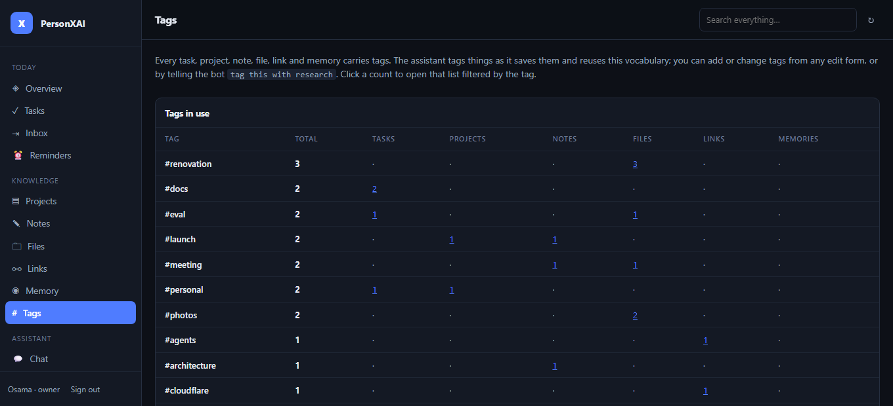

# Web dashboard

A single-page control panel served by the **same Worker** as the bot, on the same origin.
It reads and writes through the same repos the agent's tools use, so nothing can drift
between the two surfaces.

```
https://<worker>/            → static SPA        (Cloudflare asset host)
https://<worker>/api/*       → dashboard API     (the Worker)
https://<worker>/auth/callback → magic-link redeem
https://<worker>/channels/telegram/webhook → unchanged
```

## Hosting

`wrangler.jsonc` declares `assets`, so `./public` ships with the Worker on a normal
`npx wrangler deploy` — one deploy, one origin, no second service, no CORS, no build step.

```jsonc
"assets": {
  "directory": "./public",
  "binding": "ASSETS",
  "not_found_handling": "single-page-application",
  "run_worker_first": ["/api/*", "/auth/*", "/channels/*", "/dispatch", "/admin/*", "/health"]
}
```

Only the listed paths reach the Worker; everything else is served by Cloudflare's asset
host at the edge and never spends a Worker invocation. Unknown paths render `index.html`
so client-side routing works on refresh.

**Where it lives:** `https://personxai.<your-subdomain>.workers.dev` out of the box.
To use your own domain, add a route in `wrangler.jsonc` — the domain must be on Cloudflare:

```jsonc
"routes": [{ "pattern": "assistant.example.com", "custom_domain": true }]
```

**Other front doors.** The SPA can also be served from a different origin that proxies the API to the Worker — [Vercel](VERCEL.md) ships ready-made (`vercel.json` + `middleware.js`), and a self-hosted [Docker](DOCKER.md) install behind a tunnel is the same shape. Two Worker settings make that work: `PUBLIC_BASE_URL` (where login links and the Mini App button point) and `ALLOWED_ORIGINS` (which origins the CSRF guard below accepts).

Static assets and the dashboard's own requests fit comfortably in the Workers free tier;
asset requests are not billed as Worker invocations.

## Group by & tag chips (Odoo-style)

<p></p>
<p></p>

Every list view (Tasks, Projects, Notes, Files, Links, Memory, Wallet) has a **Group by** select in its toolbar and a row of **tag chips** under it. Chips are the user's real tag vocabulary with counts for that kind (`GET /api/tags`, one indexed RPC); clicking toggles the tag in the URL (`#/tasks?tag=docs,launch`) so a filtered, grouped view is a shareable link. Grouping renders one collapsible section per group with a count, unfiled/untagged sinking to the bottom — the same order the bot uses in chat.

The **Tags** view is the index: every tag, total, and per-kind counts that link straight into the filtered list.

<p></p>

## Signing in

There is no password and no third-party identity provider — **the Telegram bot is the
identity provider**:

1. Open the dashboard and press **Send me a login link** (or DM the bot `/dashboard`).
2. The Worker mints a link signed with HMAC-SHA256 and DMs it to you, **with link
   previews disabled**.
3. Opening the link shows a sign-in page that immediately submits itself, setting an
   HttpOnly session cookie and redirecting to `/`.

## Opening it inside Telegram (Mini App)

The dashboard is also the bot's **Mini App**. `POST /admin/register-webhook` points the
chat menu button at it, so tapping the button next to the message box opens the dashboard
in a webview instead of listing commands:

```jsonc
// setChatMenuButton
{ "menu_button": { "type": "web_app", "text": "Dashboard", "web_app": { "url": "https://…" } } }
```

Nothing is lost — typing `/` still shows the command menu. You can set the same thing by
hand in @BotFather with `/setmenubutton`, or under *Bot Settings → Configure Mini App*.

The URL comes from `PUBLIC_BASE_URL` when set, otherwise from the origin the registration
request arrived on. Telegram only accepts `https`, so a plain-http dev origin restores the
default commands button rather than failing registration.

### Signing in without a link

Telegram hands the webview a signed `initData` string, which proves possession of the
Telegram account exactly as a DM'd magic link does. `POST /api/auth/miniapp` verifies it
and mints **the same session cookie**, so every `/api/*` handler is unchanged:

- data-check-string = every field except `hash`, sorted by key, joined with `
`
- `secret_key = HMAC_SHA256(<bot_token>, "WebAppData")`, then compare
  `hex(HMAC_SHA256(data_check_string, secret_key))` against `hash` in constant time
- `auth_date` must be within 24 h (and not in the future beyond 5 min of clock skew)

`signature` stays **inside** the data-check-string. It is excluded only from the
third-party Ed25519 check; dropping it here makes every real launch fail to verify.

The identity must already exist in `user_identities` — the Mini App is a second door onto
the same account, never a way to create one. The client authenticates before its first
request rather than after a 401, so a launch never flashes the signed-out card, and a
mid-session 401 silently re-authenticates from the launch `initData`.

Inside the webview `app.js` also calls `ready()`/`expand()`, disables vertical swipes (so
a flick on a list does not close the app), and maps Telegram's `themeParams` onto the
stylesheet's own CSS variables. Sign-out and the "DM me a link" affordances are hidden:
the webview re-authenticates on every launch, so there is nothing to sign out of.

### Why redeeming is a POST

A magic link that is spent by a plain `GET` is spent by whatever fetches it first — and
that is rarely the human. Telegram unfurls links from its own servers within a second of
the message being sent; corporate link scanners and browser prefetchers do the same. The
nonce would be burned before the recipient ever tapped, and every link would report
"already used".

So the flow is split:

| Request | Effect |
|---|---|
| `GET /auth/callback?t=…` | Checks the signature and expiry only. Renders a page. **Touches no state** — the handler is not even given a database handle. |
| `POST /api/auth/redeem` | Burns the nonce, sets the session cookie, redirects to `/`. |

Crawlers issue GETs and never submit forms, so they cannot spend a nonce. The page
auto-submits via a short script, so a real browser is still one tap; the visible
**Sign in** button covers JavaScript being unavailable. The page carries
`Cache-Control: no-store` and contains no links for a crawler to follow.

The token is kept out of `Referer` by `history.replaceState`, which drops it from the URL
before the form submits — **not** by a `no-referrer` policy. That distinction matters: per
the Fetch spec a `no-referrer` document sends `Origin: null` on a POST, which the
same-origin guard then rejects. `assertSameOrigin` treats `Origin: null` as inconclusive
rather than hostile and falls back to `Sec-Fetch-Site`, which no referrer policy can
rewrite, so a sandboxed or redirect-laundered same-origin post still works while a genuine
cross-site post is still refused.

Link previews are suppressed on the DM as well (`disablePreview` on the outbound port),
so the crawler never fetches the URL in the first place. Belt and braces: either measure
alone would fix today's symptom, but only the POST split also covers forwarded links and
third-party scanners.

| Property | Value |
|---|---|
| Link lifetime | 10 minutes |
| Link uses | one — the nonce is stored in `settings` and burned on redeem |
| Session lifetime | 7 days, `HttpOnly; SameSite=Lax; Secure` (Secure dropped on `http://localhost`) |
| Rate limit | 3 links, then 1 per minute, per user |
| Signing secret | `WEB_SESSION_SECRET`, falling back to `DISPATCH_SECRET` |

The website button always sends to `OWNER_TELEGRAM_ID` and takes no input, so an
anonymous visitor cannot enumerate users or aim a message at anyone. Non-owner users get
their link from `/dashboard` in Telegram, where Telegram has already proved who they are.

Magic-link and session tokens are domain-separated inside the signature, so neither can be
replayed as the other. `is_allowed = false` in Postgres logs a session out on its next request.

Adding `WEB_SESSION_SECRET` is optional but recommended — it lets you invalidate every
session without rotating the dispatcher secret:

```bash
npx wrangler secret put WEB_SESSION_SECRET   # any string ≥ 16 chars
```

Optionally put **Cloudflare Access** in front of the hostname (Zero Trust → free for 50
users, requires a custom domain) for a second factor before the page even loads.

## What you can control

| Area | Read | Write |
|---|---|---|
| Overview | counts, due-soon, reminders, 24h usage | complete a task, run routines |
| Tasks | filter by status / project / overdue, **tag chips** (multi-select, AND), **group by** project · status · priority · tag · date | create, edit, complete, delete |
| Projects | list with open/done/note counts | create, edit, set progress, archive |
| Notes | search, filter | create, edit, pin, delete |
| Inbox | pending captures | promote to task or note, dismiss |
| Reminders | one-off and recurring | create (incl. RRULE), edit, pause, cancel |
| Files | search name / caption / extracted text, filter by kind / channel / tags, **group by** project · kind · channel · tag · date, **Open ↗** the post in its Telegram channel | rename, caption, re-project, edit tags, **move to another channel**, **send to your Telegram**, remove from index |
| Vault channels (Files view) | every connected private channel with category, tags, file count | connect by id, edit category/tags, enable/disable, sync from description, make default, remove |
| Tags | every tag with per-kind counts; click a count to open that list filtered | — (edit tags on each item) |
| Memory | memories + the facts injected every turn | create, edit, forget, add/delete facts |
| Links | search saved links | edit title/summary/tags, delete |
| Wallet | spent / received / left per currency for a period, the full history, and spending by category, **group by** category · kind · date · tag · project | record an expense or income, edit, delete, set the default currency |
| Chat | transcript of any context | send a message or `/command`, switch, archive, start a context |
| Personalization | active instructions + version history | save a new version, restore, clear |
| Skills & MCP | skills and server health | create/edit/enable skills, add/disable/remove MCP servers |
| Activity | audit log, agent runs, tokens, cost | — |
| Settings | account | display name, timezone, language, autonomy level |
| System | provider, per-role models, endpoints, limits | run dispatcher, send daily brief, send heartbeat |

### Deliberate limits

- **File bytes never transit the Worker.** They live in the Telegram vault channel, which is
  why 2GB files work at all. The dashboard shows metadata and delivers a file with
  `copyMessage` to your chat — there is no download link, and deleting a file removes it
  from the index, not from the channel.
- **Chat replies land in Telegram.** `POST /api/chat` hands the message to the same Durable
  Object the webhook uses, so it goes through the same router, tools, confirmations, and
  audit trail. The answer arrives where the conversation lives; the panel shows the
  transcript on reload.
- **Secrets are write-only.** API keys are Worker secrets and are never sent to the browser.
  The System view shows endpoints and model ids; change keys with `wrangler secret put`.
- **Notes and memories created here have no embedding** (computing one per keystroke would
  cost a model call). They are found by keyword immediately, and vector search picks them up
  after the agent next touches them.
- **`viewer` role is read-only**, enforced server-side, mirroring `roleAllowsPermission`.
- **Wallet entries are not in the cross-entity tag index.** They carry tags and filter by them
  in their own view and in `/wallet #tag`, but `/tags`, `/find` and the tag chips count the
  six knowledge kinds. Money groups by **category**, which is the axis that means something
  for spending.
- **Projects archive, they don't delete** — tasks and notes still reference them.

## API shape

All routes are JSON, cookie-authenticated, and scoped to the session's `user_id` — never a
body field. Non-`GET` requests are rejected when the `Origin` header is foreign, on top of
`SameSite=Lax`.

```
POST   /api/auth/request                  GET    /api/bootstrap
GET    /auth/callback?t=…   (no state)    GET    /api/overview
POST   /api/auth/redeem     (burns nonce) PATCH  /api/user
POST   /api/auth/logout

GET|POST      /api/{projects,tasks,notes,memories,reminders,skills,conversations,vault,wallet}
GET           /api/tags                 POST /api/files/:id/move   POST /api/vault/:id/sync
PATCH|DELETE  /api/{projects,tasks,notes,memories,reminders,skills,links,files,mcp,wallet}/:id
GET           /api/{inbox,files,links,facts,mcp,prompt,audit,usage,system,search}
PUT|DELETE    /api/{facts,prompt}
GET           /api/wallet/summary        PUT  /api/wallet/currency
POST          /api/inbox/:id/resolve      POST /api/files/:id/send
POST          /api/conversations/:id/{activate,archive}
POST          /api/{chat,system/dispatch,system/routine}
```

Every write is recorded in `audit_logs` with a `web.*` action, so the Activity view shows
dashboard edits and bot actions in one timeline.

## Local development

```bash
npx wrangler dev            # http://localhost:8787
```

Assets and API are served together, exactly as in production. The session cookie drops its
`Secure` flag on plain http so sign-in works on localhost.

## Files

| Path | Purpose |
|---|---|
| `public/index.html` | SPA shell |
| `public/app.js` | client — views, router, forms (no framework, no build) |
| `public/styles.css` | dark/light theme |
| `src/web/index.ts` | route ownership + error mapping |
| `src/web/auth.ts` | magic links, sessions, `/dashboard` support |
| `src/web/miniapp.ts` | Telegram Mini App `initData` verification + sign-in |
| `src/web/session.ts` | HMAC token mint/verify, cookies |
| `src/web/api.ts` | REST handlers over the repos |
| `src/web/http.ts` | request parsing, field validation, path matching |
