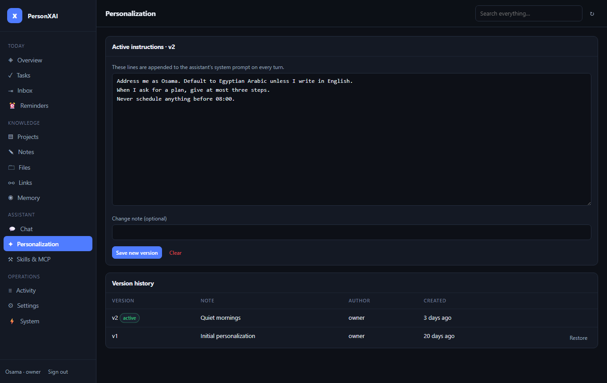

# Skills, personalisation & MCP

Three ways to make the assistant *yours* without touching code. All three are stored in Postgres, versioned or audited, editable from Telegram **and** the dashboard, and they all pass through the same permission gate as built-in tools.

 

## 1 · Skills — repeatable workflows

A **skill** is a named set of instructions the model follows step by step, optionally restricted to a list of tools, with phrases that trigger it.

### Create one from chat

> *"create a skill called weekly review that lists my projects, flags any without activity for two weeks, and drafts a summary note with three focus items"*

The model calls `create_skill`; at autonomy ≤ 1 you get a **Confirm / Cancel** prompt. The skill is saved with:

| Field | Meaning |
|---|---|
| `name` | how you'll call it (`run my weekly review`) |
| `description` | one line shown in `/skills` and the dashboard |
| `instructions` | directions the model follows when the skill runs — written *to itself* |
| `tools` | tool names it may use (`['*']` or omitted = all it normally has) |
| `triggers.keywords` | up to 10 phrases; when your message contains one, the skill is surfaced to the model automatically |
| `enabled` | toggle without deleting |
| `version` | bumps on every edit |

### Create one from the dashboard

**Skills & MCP → New skill** — same fields, useful for longer instructions. You can paste multi-step checklists, style guides, or a template for a note.

### Run it

- Say its name: *"run my weekly review"*, *"do the paper triage on this PDF"*.
- Or any trigger keyword: the orchestrator matches `triggers.keywords` (and the skill name) against your message and tells the model *"saved skills that match this request — call `run_skill`"*. The model then loads the instructions and carries them out with its normal tools.

`run_skill` returns the instructions and allowed tools; the wrapper still enforces RBAC and confirmations on every tool the skill uses, so a skill cannot escalate what the user is allowed to do.

### Manage

`/skills` lists them (🟢 enabled / ⚪ disabled). *"disable the weekly review skill"* → `toggle_skill`. *"delete the paper triage skill"* → `delete_skill` (destructive → confirm). The dashboard has Enable / Edit / Delete per row.

### Good skill recipes

| Skill | Instructions (abridged) | Tools |
|---|---|---|
| **weekly review** | list projects + overdue tasks; flag projects idle > 14 days; draft note "Weekly review <date>" with 3 focus items; *ask* before creating reminders | `list_projects`, `list_tasks`, `create_note` |
| **paper triage** | `get_file_text` on the referenced PDF; write a note with Problem / Method / Results / Relevance; tag file `paper` | `get_file_text`, `create_note`, `tag_file` |
| **inbox sweep** | for each pending inbox item propose task / note / dismiss with one-line reason; execute only on "yes" | `list_inbox`, `organize_inbox`, `resolve_inbox_item` |
| **meeting notes** | given a voice-note transcript, extract decisions, action items (as tasks with owners/dates) and open questions into a note | `create_note`, `create_task` |
| **link digest** | summarise links saved this week into one note grouped by tag | `list_links`, `create_note` |

## 2 · Personalisation — durable behaviour changes

The base system prompt is immutable. On top of it sits a **versioned personalisation layer** (`system_prompts`) that is appended to every turn.

- From chat: *"from now on answer in Egyptian Arabic unless I write English, keep plans to three steps, and never schedule anything before 08:00"* → `set_personalization` (always confirms). The base anti-hallucination rules still apply.
- From the dashboard: **Personalization** view — edit the active text, save as a new version with a note, restore any earlier version, or clear.

Alongside it, **facts about you** (`user_facts`, key → value) are injected every turn: *"remember that my wake time is 06:30"* → `remember_about_user`. `/memory` shows them; the **Memory** view edits them.

## 3 · MCP servers — external tools

PersonXAI is an [MCP](https://modelcontextprotocol.io) client. Add a remote server and its tools appear to the model on the next message, **already gated**.

- From chat: *"connect the MCP server at https://api.githubcopilot.com/mcp/"* → `add_mcp_server` (external → confirm at autonomy ≤ 1). Optionally an auth header: *"… with header Bearer ghp_…"*.
- From the dashboard: **Skills & MCP → Add server** (name, https URL, optional `Authorization` header — stored server-side only).
- Servers that need OAuth report `authenticating` with a URL to open; the connection completes on the next turn.

`/mcp` shows health (🟢 / 🔴 last error / ⚪ disabled). The Agents SDK `MCPClientManager` handles connection lifecycle and hibernation-safe reconnects; PersonXAI only stores which servers you enabled and their last error.

### How MCP tools are gated

Every MCP tool is wrapped exactly like a built-in `external` tool:

1. Counts against the per-turn tool budget (12).
2. `viewer` role → denied.
3. `needsConfirmation({ level: "external", autonomy })` → at autonomy 0–1 an inline **Confirm / Cancel** prompt with the tool name and arguments; the model is told to stop and wait.
4. Result truncated to 4 000 chars; recorded in `tool_calls` and `audit_logs`.

Good first servers: GitHub (issues/PRs), Notion, Linear, a self-hosted [mcp-lite](https://github.com/) wrapper around your own APIs.

## The permission matrix

Built-in tools declare a `permissionLevel`; MCP tools are `external`. Confirmation depends on the user's autonomy (`/settings autonomy N`, dashboard → Settings):

| Level → \ Autonomy ↓ | `read` | `write` | `destructive` | `external` |
|---|---|---|---|---|
| **0** | run | confirm | confirm | confirm |
| **1** (default) | run | run | confirm | confirm |
| **2** | run | run | confirm | run |
| **3** | run | run | run¹ | run |

¹ Tools flagged `irreversible` (permanent deletes) still confirm at 3. Tools with `requiresConfirmation: true` (e.g. `set_personalization`, `create_skill`) always confirm. Reason priority: `tool_flag > irreversible > autonomy`.

Roles: `owner` (everything), `admin`, `user`, `viewer` (read-only, enforced server-side in both the bot and the dashboard API).

## Where things live

| | Table | Bot | Dashboard |
|---|---|---|---|
| Skills | `skills` | `create_skill` `run_skill` `toggle_skill` `delete_skill` `list_skills`, `/skills` | Skills & MCP |
| Personalisation | `system_prompts` (versioned) | `set_personalization` | Personalization |
| Facts | `user_facts` | `remember_about_user` `forget_about_user`, `/memory` | Memory |
| MCP servers | `mcp_servers` | `add_mcp_server` `remove_mcp_server` `list_mcp_servers`, `/mcp` | Skills & MCP, System |
| Every action | `audit_logs`, `tool_calls` | — | Activity |
